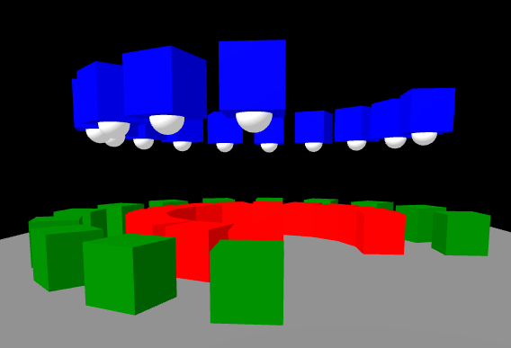

## A-MULTIPLY

<i>This componet replaces the previous used "rotate-y"</i>

Some space ships are build with a-frame entities, also using this A-Frame Component "a-multiply".

This control takes its sub-entities, multiplies them and places the copies as given by parameter "mode".
* The mode "rotatory" places the copies in a cycle. More modes TODO
* The position angles go from parameter "start" to "end" by "step".
* The rotation axis is given by the parameter "axis" TODO
* As radius, the value of sub-entities position is used. Select the axis by parameter "radius". TODO
* The copies are rotated so the same child-side shows to the center of the cycle. (TODO: optinally)
This allows complex structures by less work and HTML text.


### Properties

| Property | Description                                             | Default Value |
| -------- | -----------                                             | ------------- |
| mode     | How to place the copies: rotatory, TODO                 | rotatory      |
| axis     | Modes: rotatory. What axis to rotate around.            | y             |
| radius   | Modes: rotatory. What position axis to set the radius   | x             |
| start    | Angle the first entity is rotated.                      | 0             |
| step     | Angle each of the next entities is increased.           | 30            |
| end      | Maximal used angle. Instancing will stop afterwards.    | 360-1         |

### Usage

Use <a-multiply> like <a-entity> as a "parent" and place "childs" to be multiplied and aranged.
Any type of childs should work (a-box, geometry:box, mixin). Sub-childs and animations are possible to.
a-multiply is NOT recrusive usable (yet).

```html
      <a-multiply id="multi" step="22.5" end="270" position="0 0 -10" >
        <a-entity   id="sub"     position="5  0   0" geometry="primitive: box" material="color:green" ></a-entity>
        <a-box      id="box"     position="4  3   0"                           material="color:blue"  >
          <a-sphere id= "sphere" position="0 -0.5 0" radius="0.3"                                     ></a-sphere>
        </a-box>
      </a-multiply>
```

[Demo](http://ac1000.de/sfsfs/components/a-multiply/demo.html)


